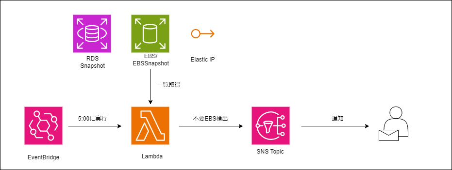
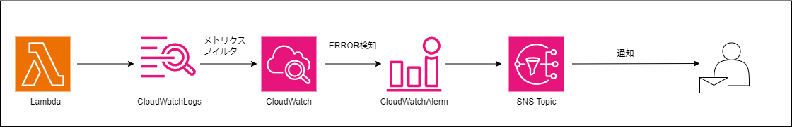

## ツールの目的
このツールの目的はAWS環境上で日々の運用で発生する不要なデータを検知し、データ管理プロセスを最適化することです。日々の運用で発生する不要なデータが見過ごされることにより、クラウドコストが過剰に発生している可能性があります。このツールは運用上のデータ管理プロセスを効果的に改善し、見逃されがちな不要なデータによるクラウドコストの増加を防ぐことに役立ちます。

## 構成
#### 不要スナップショット検出

#### Lambdaエラー通知

## 機能
  - 不要EBS検知機能 
    AWS環境上に存在するステータスが利用可能（available）のAWS EBSを検知します。検知スクリプトは毎日am5時(JST)に自動実行されます。 これらのEBSボリュームは、他のAWSリソースに紐づいておらず、削除忘れの可能性が高いです。もし必要なデータを保持している場合、スナップショットを作成し、データのバックアップを取った上でボリュームを削除することで、コスト削減の効果が期待できます。
  - 不要RDS手動スナップショット検知機能 
    AWS環境上に存在する同一RDSにおいて重複して取得されている、かつ指定した日数以上前に手動で作成された RDS スナップショットを検知します。検知スクリプトは毎日am5時(JST)に自動実行されます。
  - 不要EBSスナップショット検知機能 
    AWS環境上に存在する指定した日数以上前に作成されたEBSスナップショットを検知します。検知スクリプトは毎日am5時(JST)に自動実行されます。 
  - 不要Elastic IP検知機能 
    AWS環境上に存在する"AssociationId"がないElastic IPを検知します。"AssociationId"がないElastic IPとは、どのリソースにも関連付けられていない Elastic IP です。検知スクリプトは毎日am5時(JST)に自動実行されます。 
  - 通知機能 
    不要データを検知した場合、指定のEmailアドレスに対象データ記載のメールが送信されます。
  - 検知スクリプトエラー通知機能 
    検知スクリプト実行時に何らかの理由でエラーが発生した場合、指定のEmailアドレスにエラー内容を記載したメールが送信されます。

## 使用するAWSサービス
  - Lambda 
    AWS Lambdaは、サーバーレスコンピューティングを提供するサービスであり、コードの実行をトリガーに応じて自動的に処理します。このツールでは、Lambdaを使用して不要なデータの検知プロセスを実行します。
  - Amazon SNS 
    Amazon SNSは、分散型のメッセージングサービスであり、簡単かつ信頼性の高いメッセージングを提供します。不要なデータが検知された場合、またLambda関数でエラーが発生した場合、SNSトピックとサブスクリプションを使用して通知を発行し、指定のEmailアドレスにアラートを送信します。
  - Amazon CloudWatch 
    Amazon CloudWatchは、アプリケーション、システム、リソースの監視と管理を提供します。このツールでは、CloudWatch Logsを使用してログデータを収集し、Lambda関数のエラーを検知し、CloudWatchアラームを設定して検知をトリガーします。
  - Amazon EventBridge 
    Amazon EventBridgeは、イベントを使用してアプリケーションコンポーネント同士を接続するサーバーレスサービスです。このツールでは、EventBridgeルールを使用して毎日am5:00(JST)にLambda関数を実行し、データの検知プロセスを開始します。
